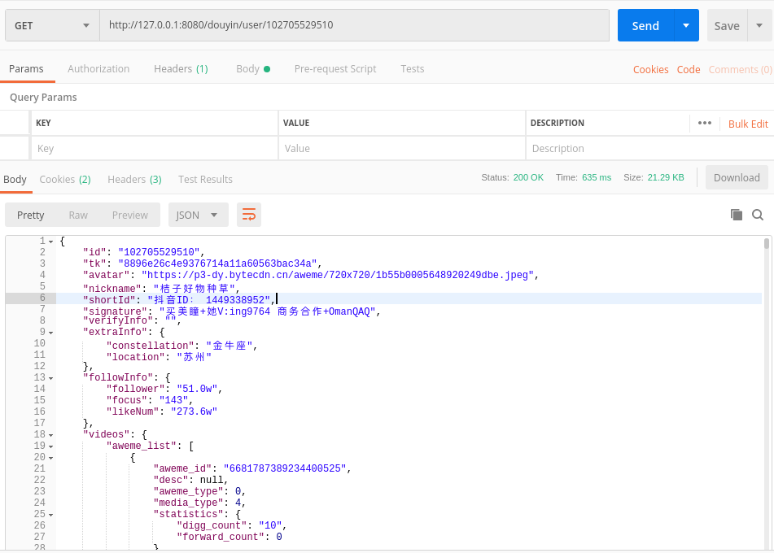

## Introduction
TODO

### Dependencies
- gRPC
- https://github.com/yidongnan/grpc-spring-boot-starter

### Features

## How to run
- run `micro-node-douyin`, see <https://github.com/Danceiny/micro-node-douyin#how-to-run>
- run application by `IntelliJ IDEA`.

## How to develop
TODO

## References
TODO

